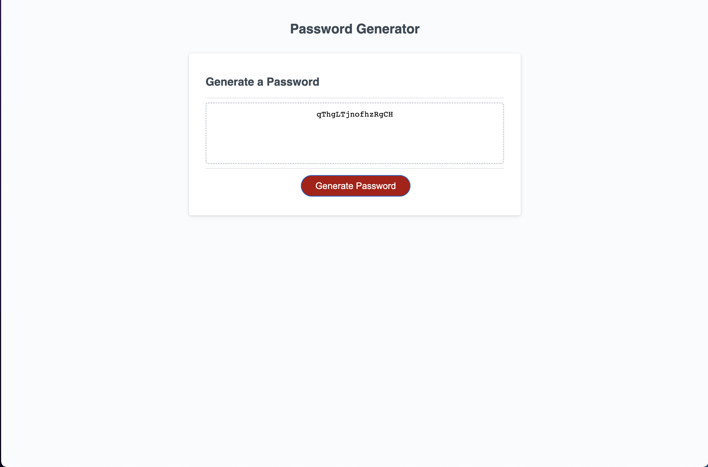

# password-generator

## Description

The purpose of this project is to randomly generate a password based on certain criteria when the generate password button is pressed. This helps avoid reusing old passwords and can be used as often as needed.

## Usage

To use this webapp, load the webpage and answer the criteria when prompted. If you enter criteria incorrectly (e.g. using fewer than 8 characters or selecting no criteria) you will need to refresh the page to try again. To generate a password once the criteria has been answered, simply press the generate password button shown in red in the screen show below.

    

Here is a link to the deployed webapp: https://rwwoods.github.io/password-generator/
## Credits

Code for the HTML and CSS, along with a small bit of started JavaScript code, comes from the UPENN LPS coding bootcamp. 

I would also like to thank my wife, Alissa, who even with only limited coding knowledge was able to help me figure out an issue with one of my for loops by talking it through with me. Thanks wife.

## License

Standard MIT License.
